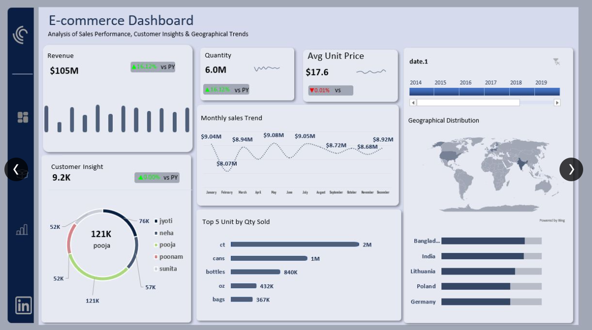
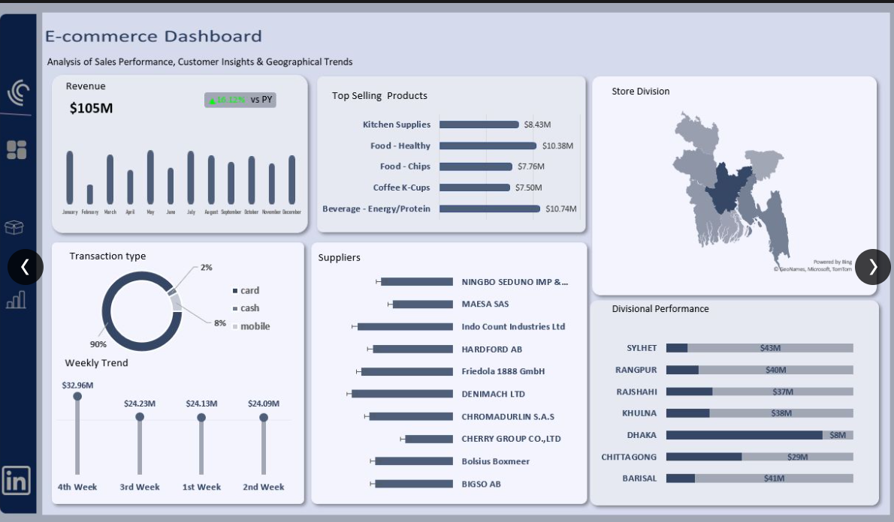

# E-Commerce Sales Performance Dashboard

## Overview
An interactive sales analytics dashboard tracking key performance metrics including total revenue, customer acquisition, product performance, and regional demand. Built as a Final Project for the Horizon 5-Month Data Analytics Training Programme (February 2026).

**Team:** Segun, Modupe & Juwon

## Tools Used
- Microsoft Excel (Pivot Tables, Dashboard, KPI Cards)
- Power Query (Data Cleaning & Transformation)
- Microsoft PowerPoint (Presentation & Wireframing)
- Power BI (Superstore supplementary analysis)

## Key Metrics

| Metric | Value | YoY Change |
|---|---|---|
| Total Revenue | $105M | +16.12% |
| Units Sold | 6M | +16.12% |
| Active Customers | 9.2K | +0.09% |
| Avg Unit Price | $17.6 | -0.01% |

## Key Findings
- Total revenue reached **$105M**, up 16.12% year-on-year; growth is volume-driven, not price-driven
- **Bangladesh** is the top market at $13.34M — Dhaka underperforms at just $8.2M despite being the capital
- **Card payments** dominate at ~90% ($94.6M); mobile money represents untapped growth
- Top customer **Pooja** leads at 121K in purchases — heavy concentration risk
- **May** was the strongest month ($9.08M); **February** the weakest ($8.07M)

## Top Product Categories
1. Beverage – Energy/Protein: $10.74M
2. Food – Healthy: $10.38M
3. Kitchen Supplies: $8.43M

## Dashboard Preview

## Files in This Repository

| File | Description |
|---|---|
| `E-commerce analysis.xlsx` | Main Excel workbook with dashboard, pivot tables & KPIs |
| `E-commerce final slide.pptx` | Presentation deck with insights & recommendations |
| `E-commerce wireframe.pptx` | Dashboard wireframe and design planning |
| `Customer Churn Dashboard.xlsx` | Customer churn analysis workbook |
| `Emmanuel Sample Superstore data.pbix` | Power BI report on superstore sales |

## How to Use
1. Download `E-commerce analysis.xlsx`
2. Open in Microsoft Excel (2016 or later recommended)
3. Navigate to the Dashboard tab and use slicers to filter by region, category, or time period

## Recommendations
1. Scale Bangladesh operations — top market; invest in local logistics
2. Grow the customer base — launch referral and retention campaigns
3. Fix Dhaka underperformance — review distribution channels and pricing
4. Diversify payment options — mobile money opportunity in emerging markets
5. Introduce subscription models for Coffee K-Cups and repeat-purchase categories

---
*Horizon 5-Month Data Analytics Training — Final Project Defence, February 2026*
*Data Analyst: Ajibola Modupe Abigail | Lagos, Nigeria*
